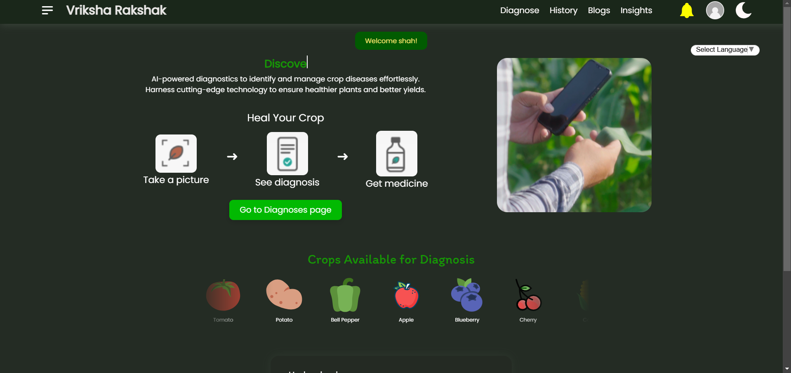
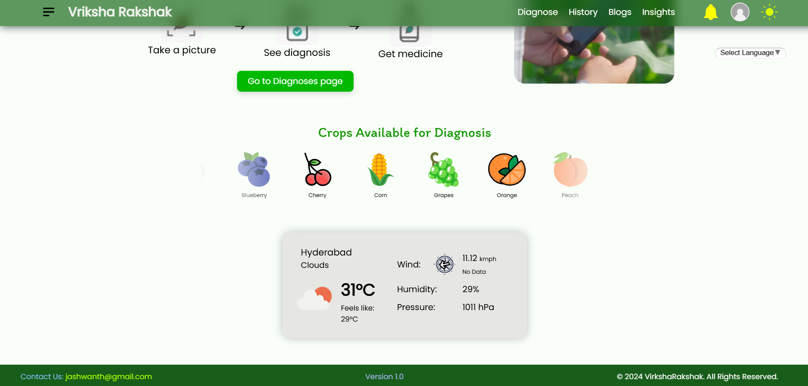

# Vriksha Rakshak
Vriksha Rakshak is an *AI Driven Plant Disease Detection System* that aims to ***Ease the Diagnosis process of Diseased Plants***. It is part of the Project School Program of KMIT

  

## Key Features:
1. ***Detailed Diagnosis Report:***: 
    1. Disease name with Confidence score
    2. Symptoms
    3. Organic and Inroganic Treatment options
    4. Preventive measures 
2. ***Timely Alerts:***  like *13 Tomato Leaf Blight cases have been diagnosed in your area*, Alerts can be cutomized by the Agricultural Scientist. 
3. ***Analytics:*** based on location, user's past diagnosis, viewed in Agricultural Seasons or Month Wise 
4. ***History:*** for checking past Diagnosis 
5. ***Blogs:*** for promoting users to learn and post insightful details 
6. ***Not satisfied with Report Option:*** If the user is not satsified with the provided report, the user can send it to the Agricultural Scientist for getting the corrected report or getting more information about the particular disease (*Bridges the connection between a professional - Agricultural Scientist and a normal user - Farmer*) 
7. ***Weather:*** based on user's location and ***Multi Lingual support*** 
8. ***Highly Responsive Design: Supports upto 300px devices***  
9. ***Camera feature for smaller devices*** 
9. ***Clean and easy UI:*** for non technical literates to easily browse through the sections 

[Presentation Of Project](https://docs.google.com/presentation/d/11H8co6SnXv_Zp-aIvGhkv10VElruL5Yy/edit?usp=sharing&ouid=115451759199260958875&rtpof=true&sd=true)